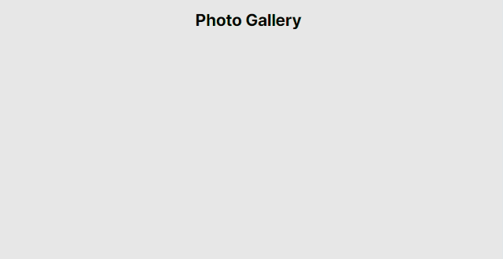

# Gallery

An infinite-scroll web app that lets users browse and favorite photos using the [Pexels API](https://www.pexels.com/api/).

# 💻 Demo

[https://photo-gallery-ts.netlify.app/](https://photo-gallery-ts.netlify.app/)

<!--  -->

</br>

# 🎨 Main features

- Infinite scroll
- A possibility to favourite an item
- Lazy loading, responsive images

# 🔧 Technologies used

- JavaScript library: [React](https://reactjs.org/)
- TypeScript support: [TypeScript](https://www.typescriptlang.org/)
- Build tool: [Vite](https://vitejs.dev/)
- Styling: [CSS Modules](https://github.com/css-modules/css-modules/) with [SASS](https://sass-lang.com/)
- Code linting: [ESLint](https://eslint.org/) with [Airbnb Style Guide](https://airbnb.io/javascript/react/)
- Code formatter: [Prettier](https://prettier.io/)
- Style linting: [Stylelint](https://stylelint.io/)
- Pre-commit hook for formatting and linting: [Husky](https://typicode.github.io/husky/) and [lint-staged](https://github.com/okonet/lint-staged/)
- Testing: [Jest](https://jestjs.io/) with [React Testing Library](https://testing-library.com/docs/react-testing-library/intro/), [Jest-DOM](https://testing-library.com/docs/ecosystem-jest-dom/), [User Event](https://testing-library.com/docs/user-event/intro/)
- Package manager: [pnpm](https://pnpm.io/)

# 🚀 Getting started

[](https://nodejs.org/)
[](https://www.npmjs.com/package/pnpm/v/8.15.4)

### 🔨 Configure files

Rename `.env.example` to `.env` and put your [Pexels API key](https://www.pexels.com/api/new/) in it

```bash
mv .env.example .env
```

### 🎈 Start the project

```bash
# If you want to create a Git repository and use Git hooks
git init

# Install dependencies
pnpm i

# Run in the development mode
pnpm dev

# To make the development server accessible on a different device, run
pnpm start

```

### 🆚 VS Code integration

To enable all app development features, you will need the following VS Code extensions

- [ESLint](https://marketplace.visualstudio.com/items?itemName=dbaeumer.vscode-eslint)
- [Prettier - Code formatter](https://marketplace.visualstudio.com/items?itemName=esbenp.prettier-vscode)
- [Stylelint](https://marketplace.visualstudio.com/items?itemName=stylelint.vscode-stylelint)

User or workspace settings in [settings.json](https://code.visualstudio.com/docs/getstarted/settings)

```json
{
  "editor.codeActionsOnSave": {
    "source.fixAll": true
  },
  "editor.defaultFormatter": "esbenp.prettier-vscode",
  "editor.formatOnSave": true
}
```

[🔼 Back To Top](#top)
